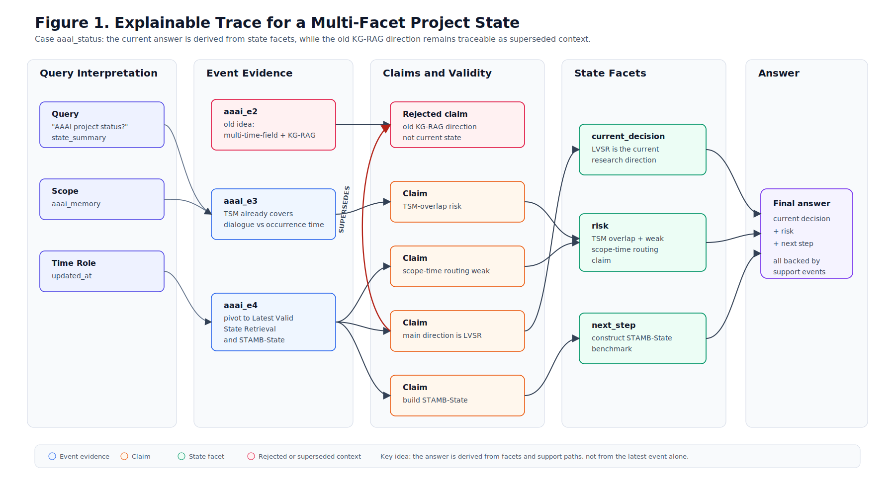
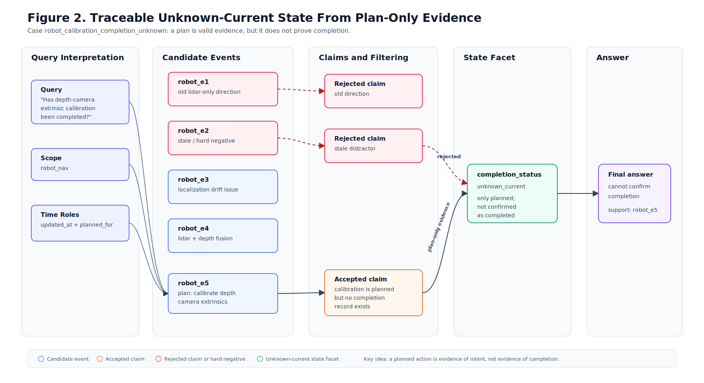

# Scope-Time-State Graph Case Figures

These are paper-facing vector figures generated from the v1.1 Ours graph-trace case studies. They illustrate explainability and traceability; they do not define new benchmark scores.

The checked-in figure files under `Design/BenchMark/figures/` are the retained paper-facing
artifacts. The temporary graph-trace JSON/Markdown generation outputs are not retained as canonical
benchmark output.

## Figure 1: Multi-Facet State With Superseded Direction

Case: `aaai_status`

Query: `AAAI 项目最近怎么样？`

Purpose: show how the graph derives multiple current state facets while rejecting an old direction that has been superseded.

Trace reading:

- `aaai_e2` is not deleted; it remains traceable as the old direction.
- `aaai_e4` explains why `aaai_e2` is no longer the current project state.
- The final answer can be traced to three state facets, not to a single latest event.

Suggested caption:

> Scope-Time-State Graph trace for a project-status query. The answer is not generated from the latest event alone; it is derived from three state facets with explicit support paths. The old KG-RAG direction remains visible as superseded context.

## Figure 2: Plan-Only Evidence Does Not Entail Completion

Case: `robot_calibration_completion_unknown`

Query: `机器人导航 depth camera 外参已经标定完成了吗？`

Purpose: show why a plan event supports an unknown-current answer instead of a completed-state answer.

Trace reading:

- `robot_e5` is valid evidence, but its claim type is `plan`, not `completion`.
- The state facet is therefore `unknown_current`, not `active completed`.
- The answer is traceable to the plan-only evidence and the absence of completion support.

Suggested caption:

> Scope-Time-State Graph trace for plan-only completion uncertainty. A planned calibration event is valid evidence of intent, but the graph prevents it from being promoted to a completed-state facet without completion evidence.

## How To Use These Figures

In the paper, these figures can support the claim that Scope-Time-State Graph provides:

- explainability: why the selected state facet is the current state;
- traceability: which original events support each facet;
- error prevention: why stale mentions, old plans, or old directions should not become current state.

For the method section, Figure 1 is stronger because it shows multiple facets and a supersession path. For the motivation or error-analysis section, Figure 2 is stronger because it shows plan-not-done and unknown-current behavior.
